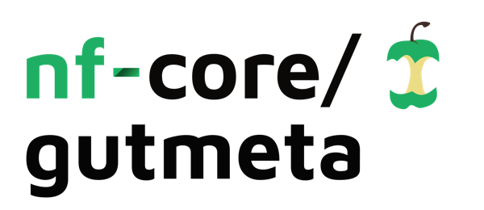

<h1>
  <picture>
    <source media="(prefers-color-scheme: dark)" srcset="docs/images/nf-core-gutmeta_logo_dark.png">
    
  </picture>
</h1>

[](https://github.com/codespaces/new/nf-core/gutmeta)
[](https://github.com/nf-core/gutmeta/actions/workflows/nf-test.yml)
[](https://github.com/nf-core/gutmeta/actions/workflows/linting.yml)[](https://nf-co.re/gutmeta/results)
[](https://www.nf-test.com)

[](https://www.nextflow.io/)
[](https://github.com/nf-core/tools/releases/tag/4.0.0)
[](https://docs.conda.io/en/latest/)
[](https://www.docker.com/)
[](https://sylabs.io/docs/)
[](https://cloud.seqera.io/launch?pipeline=https://github.com/nf-core/gutmeta)

[](https://nfcore.slack.com/channels/gutmeta)[](https://bsky.app/profile/nf-co.re)[](https://mstdn.science/@nf_core)[](https://www.youtube.com/c/nf-core)

## Introduction
**nf-core/gutmeta** is a reproducible Nextflow pipeline for shotgun metagenomic analysis of human gut microbiome samples, with an initial focus on datasets relevant to cardiovascular disease (CVD).

The workflow automates quality control, host-read removal, and taxonomic profiling from paired-end or single-end sequencing reads. It uses **FastQC** and **MultiQC** for quality assessment, **KneadData** for host decontamination and read processing, **Kraken2** for taxonomic classification, and **Bracken** for abundance estimation.

### Pipeline overview
1. **Raw-read quality control** — FastQC
2. **Initial QC reporting** — MultiQC
3. **Quality filtering and host-read removal** — KneadData
4. **Post-processing quality control** — FastQC
5. **Taxonomic classification** — Kraken2
6. **Taxonomic abundance estimation** — Bracken
7. **Final QC and reporting** — MultiQC

## Usage
> [!NOTE]
> If you are new to Nextflow and nf-core, please refer to [this page](https://nf-co.re/docs/get_started/environment_setup/overview) on how to set-up Nextflow. Make sure to [test your setup](https://nf-co.re/docs/get_started/run-your-first-pipeline) with `-profile test` before running the workflow on actual data.

### Prerequisites

The pipeline requires:

- Nextflow
- Docker, Singularity/Apptainer, or another supported execution environment
- A valid input samplesheet

For local development, the pipeline can also be run using the provided Conda environment.

### Input samplesheet

The pipeline accepts a CSV samplesheet containing sample identifiers and sequencing read paths.

```csv
sample,fastq_1,fastq_2
sample_01,/path/to/sample_01_R1.fastq.gz,/path/to/sample_01_R2.fastq.gz
sample_02,/path/to/sample_02_R1.fastq.gz,/path/to/sample_02_R2.fastq.gz
```

## Download data from SRA

### Obtaining data from SRA

Raw sequencing data can be downloaded from the NCBI Sequence Read Archive (SRA) using [`nf-core/fetchngs`](https://nf-co.re/fetchngs/).

Create an input file containing the SRA accession(s):

```csv
SRR17988757
SRR17988758
```

```bash
nextflow run nf-core/fetchngs \
    -profile docker \
    --input sra-ids.csv \
    --outdir sra_downloads
```

### Run the pipeline

To run the pipeline with Docker:

```bash
nextflow run . \
    -profile docker \
    --input samplesheet.csv \
    --outdir results
```

For a quick validation of the installation, run the included test profile:

```bash
nextflow run . \
    -profile test,docker \
    --outdir results
```
Nextflow's -resume option can be used to continue an interrupted run without repeating successfully completed processes:

```bash
nextflow run . \
    -profile docker \
    --input samplesheet.csv \
    --outdir results \
    -resume
```

## Pipeline output

The pipeline produces quality-control reports, filtered sequencing reads, taxonomic classification results, taxonomic abundance estimates, and Nextflow execution reports.

For a detailed description of the output files and directory structure, see the [output documentation](docs/output.md).

## Credits

nf-core/gutmeta was originally written by Sarbjeet Niraula.

## Contributions and Support

Contributions and suggestions are welcome. Please see the [contributing guidelines](docs/CONTRIBUTING.md) for more information.


## Citations
An extensive list of references for the tools used by the pipeline can be found in the [`CITATIONS.md`](CITATIONS.md) file.

You can cite the `nf-core` publication as follows:

> **The nf-core framework for community-curated bioinformatics pipelines.**
>
> Philip Ewels, Alexander Peltzer, Sven Fillinger, Harshil Patel, Johannes Alneberg, Andreas Wilm, Maxime Ulysse Garcia, Paolo Di Tommaso & Sven Nahnsen.
>
> _Nat Biotechnol._ 2020 Feb 13. doi: [10.1038/s41587-020-0439-x](https://dx.doi.org/10.1038/s41587-020-0439-x).
